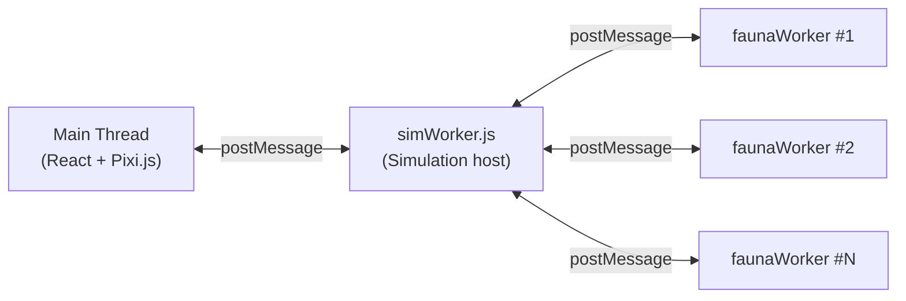

# Worker API Reference

Navigation: [Documentation Home](../README.md) > [API](README.md) > [Current Document](README.md)
Return to [Documentation Home](../README.md).

Message protocol between the main thread (React UI) and the simulation Web Worker.

## Overview

The application uses a **two-tier worker architecture**:

**Communication:** `postMessage` / `onmessage` via the standard Web Worker API. Large data (terrain, plant grids) is transferred as `ArrayBuffer` for zero-copy performance.

| Direction | Protocol | Payload Format |
|-----------|----------|----------------|
| Main → Worker | `{ cmd, ...params }` | JSON with optional ArrayBuffer transfers |
| Worker → Main | `{ type, ...data }` | JSON; arrays may be full or incremental deltas |
| Worker → Sub-worker | `{ type, ...data }` | ArrayBuffers (transferable) for plant/animal chunks |

## Contents

| Document | Description |
|----------|-------------|
| [Commands](commands.md) | Main → Worker messages (generate, start, pause, editTerrain, etc.) |
| [Messages](messages.md) | Worker → Main messages, data types, and fauna sub-worker protocol |

For a high-level overview of how the worker fits into the application, see [Architecture](../architecture.md).
