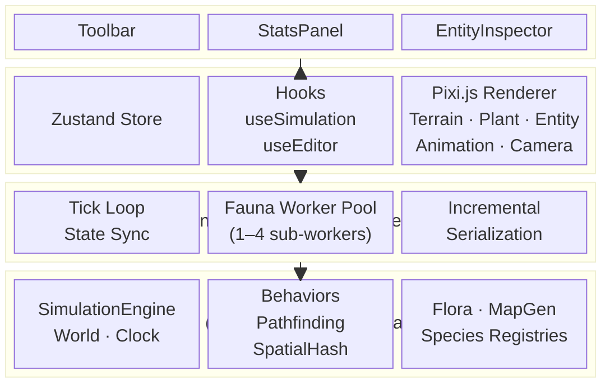
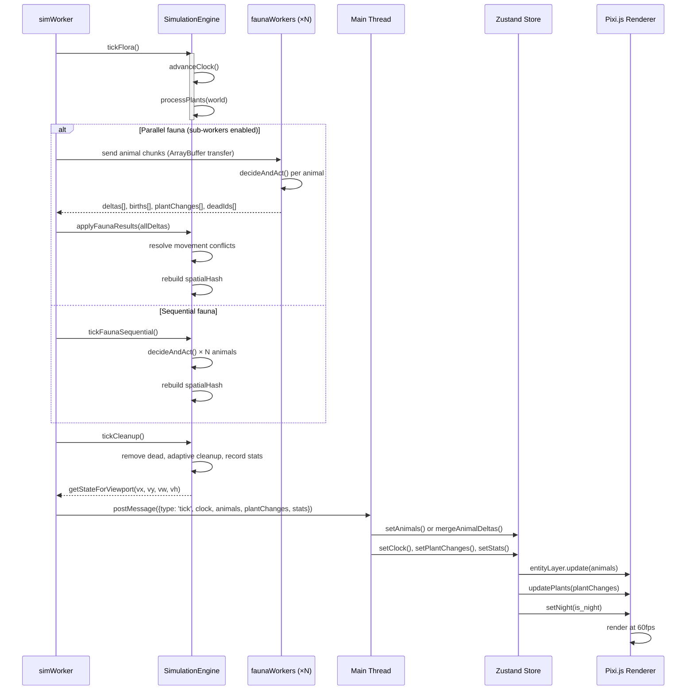
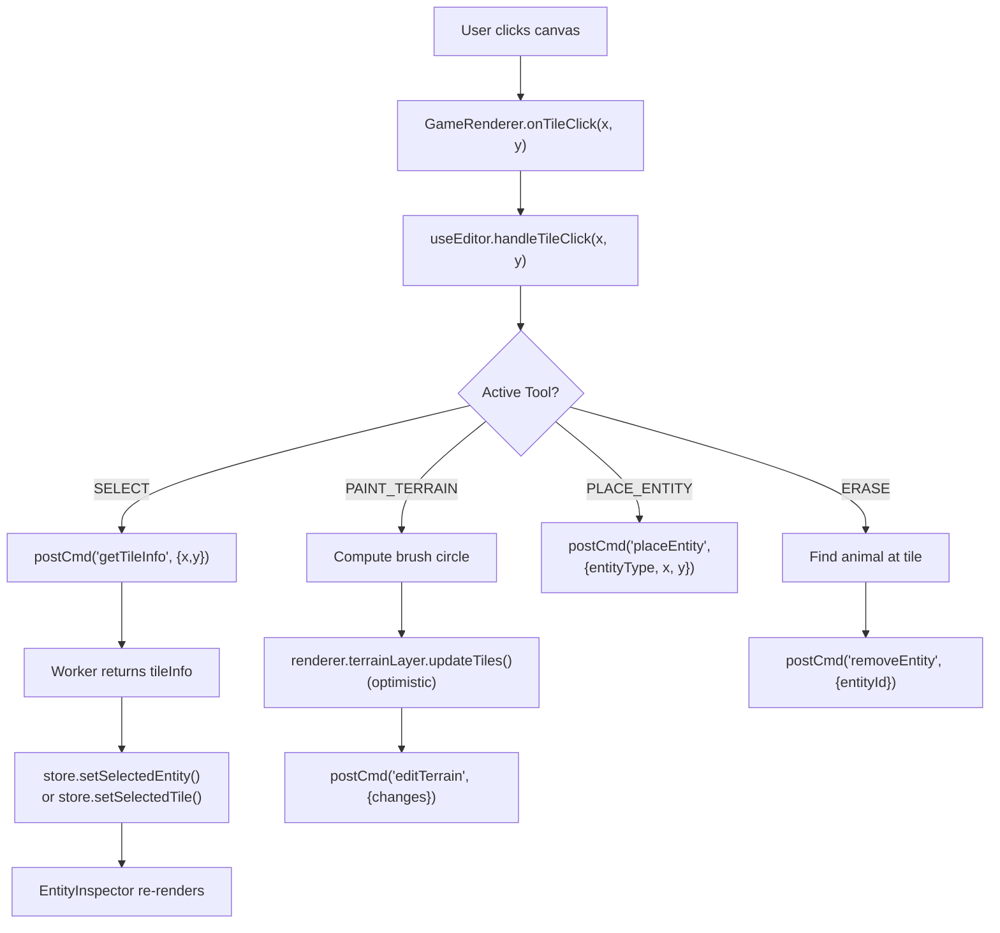
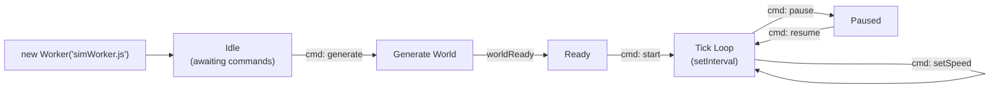
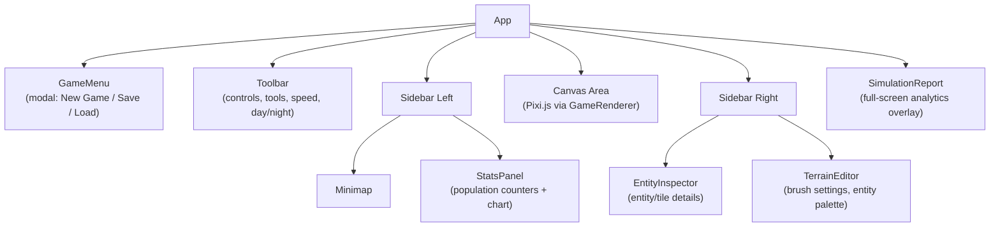

# Architecture

Navigation: [Documentation Home](README.md) > [Architecture](architecture.md)
Return to [Documentation Home](README.md).

High-level overview of how EcoGame is structured and how data flows between layers.

Related documentation: [README](README.md), [Engine](engine/), [Renderer](renderer/), [API](api/).

---

## Layer Architecture



### Boundaries

| Layer | Rules |
|-------|-------|
| **Engine** (`src/engine/`) | No DOM, no React, no Pixi. Pure classes and functions. Must be serializable for Worker. |
| **Worker** (`src/worker/`) | Hosts the engine. Communicates via `postMessage` only. |
| **Store** (`src/store/`) | Single Zustand store. Immutable updates via `set()`. No side effects. |
| **Hooks** (`src/hooks/`) | Bridge worker messages to store. Own the worker lifecycle. |
| **Renderer** (`src/renderer/`) | Pixi.js only. No game logic. Reads data, draws frames. |
| **Components** (`src/components/`) | React + Bootstrap UI. Read store, dispatch commands via hooks. |

---

## Data Flow

### Simulation Tick

The tick pipeline is split into composable phases:



Animals may be a full array or an incremental delta list (dirty-flag based; full sync every 30 ticks).

### User Interaction



---

## Worker Protocol

Communication between main thread and worker uses structured messages. See [API Reference](api/) for the full schema and payload examples.

### Worker Lifecycle & Error Handling



**Fauna worker pool sizing:**

| `navigator.hardwareConcurrency` | Sub-workers |
|---------------------------------|-------------|
| ≤ 2 | 1 |
| 3–4 | 2 |
| 5–8 | 3 |
| > 8 | 4 |

**Timeout handling:** If a parallel fauna tick exceeds **800ms**, the main worker falls back to applying partial results and logs a warning. This prevents UI freezes on large populations.

**Incremental serialization:** Animals have a dirty flag incremented on state changes. Only dirty animals are sent per tick. A full sync is forced every **30 ticks** to prevent desynchronization.

---

## Store Structure

Single Zustand store (`simulationStore.js`):

```javascript
{
  // Worker
  worker,                          // Worker instance

  // World
  mapWidth, mapHeight,             // number
  terrainData,                     // Uint8Array

  // Simulation
  running, paused,                 // boolean
  tps,                             // number
  clock,                           // {tick, day, tick_in_day, is_night}

  // Entities
  animals,                         // [{id, x, y, species, state, energy, hp, ...}]
  _animalsById,                    // Map<id, animal> (internal index for delta merge)

  // Plants
  plantChanges,                    // [[x, y, type, stage], ...]

  // Stats
  stats,                           // {herbivores, carnivores, plants_total, fruits, species}
  statsHistory,                    // array of past snapshots

  // Selection
  selectedEntity,                  // entity dict or null
  selectedTile,                    // tile info or null

  // Editor
  tool,                            // 'SELECT' | 'PAINT_TERRAIN' | 'PLACE_ENTITY' | 'ERASE'
  paintTerrain,                    // terrain constant
  brushSize,                       // number
  placeEntityType,                 // species name

  // Viewport
  viewport,                        // {x, y, w, h}
}
```

---

## Component Tree



---

## Key Design Decisions

| Decision | Rationale |
|----------|-----------|
| **Web Worker for simulation** | Keeps 60fps rendering on main thread while simulation runs independently |
| **TypedArrays for world data** | Memory-efficient grid storage; fast binary transfer to main thread |
| **Spatial hash for neighbors** | O(1) average-case lookups vs O(n) brute force; critical for AI vision/mating |
| **Single Zustand store** | Simple state management; all UI reads from one source of truth |
| **1px-per-tile textures** | Efficient rendering at any zoom; nearest-neighbor scaling preserves crispness |
| **Sprite pooling** | Limits GPU memory; max 8000 plant emojis + dynamic animal sprites |
| **Bounded A*** | `maxDist` parameter prevents pathfinding from exploring the entire map |
| **Optimistic terrain edits** | Renderer updates instantly while worker processes change asynchronously |
| **Fauna sub-worker parallelism** | Split animal AI across multiple workers; deterministic merge via ID-sorted deltas |
| **Incremental tick serialization** | Dirty-flag on `Animal`; only changed entities sent per tick, full sync every 30 ticks |
| **Integer spatial hash keys** | Packed `(cx & 0xFFFF) | ((cy & 0xFFFF) << 16)` avoids string allocation in hot loop |
| **Ring buffer action history** | O(1) `logAction` replaces O(n) `Array.shift()` — constant time regardless of history size |
| **Lazy species population cache** | `World.getAliveSpeciesCount()` caches per tick; eliminates O(N) scan in mating checks |

---

## Deep-Dive Docs

Use this page for the system map, then continue in focused references:

- [Engine Reference](engine/)
- [Simulation Rules](simulation/)
- [Renderer Reference](renderer/)
- [Worker API Reference](api/)
