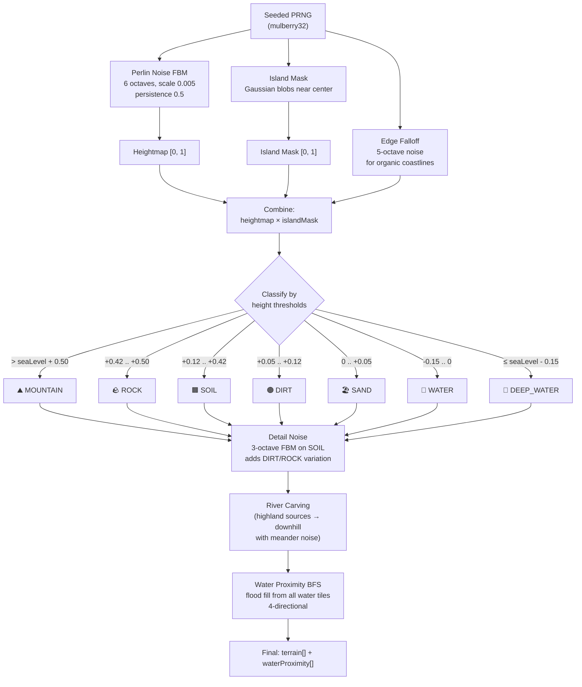
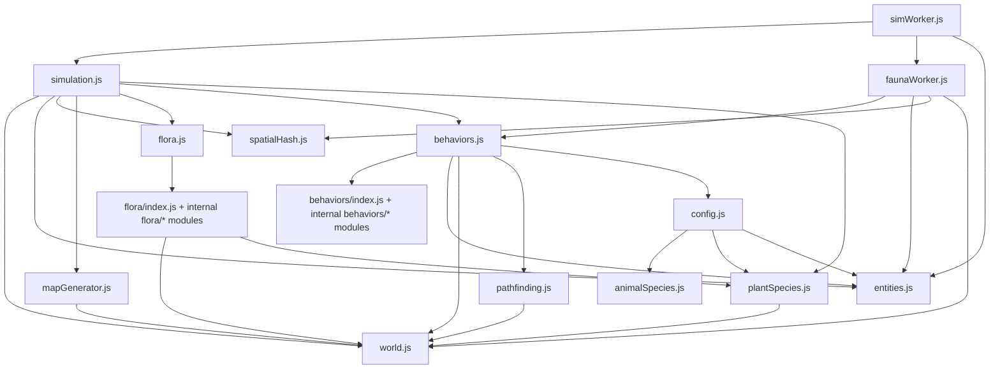

# Algorithms

Navigation: [Documentation Home](../README.md) > [Engine](README.md) > [Current Document](algorithms.md)
Return to [Documentation Home](../README.md).

---

## Terrain Generation (`mapGenerator.js`)

### `generateTerrain(config)` → `{terrain, waterProximity, heightmap, seed}`



**Pipeline:**

1. **Perlin noise FBM** — 6 octaves at scale 0.005, persistence 0.5 → heightmap [0, 1]
2. **Island mask** — Gaussian blobs centered near map center, configurable count and size
3. **Combine** — `heightmap × islandMask`
4. **Adaptive sea level** — if `min_land_ratio > 0`, the sorted height distribution is used to find the percentile value at `(1 − minLandRatio)`, and `seaLevel` is clamped downward to that value so the guarantee is met deterministically without retries.
5. **Classify terrain** by thresholds around `effectiveSeaLevel`:
    - `> sea + 0.50` → `MOUNTAIN`
    - `> sea + 0.42` → `ROCK`
    - `> sea + 0.12` → `SOIL`
    - `> sea + 0.05` → `DIRT`
    - `> sea` → `SAND`
    - `> sea - 0.15` → `WATER`
    - else → `DEEP_WATER`
6. **Detail noise** — 3-octave FBM on SOIL tiles adds DIRT/ROCK variation
7. **River carving** — optional `river_count` highland sources are traced downhill with meander noise and carved as `WATER`; lower-course widening adds natural river mouths
8. **Water proximity BFS** — flood fill from all WATER/DEEP_WATER tiles, 4-directional

### River Generation (`generateRivers`)

Rivers are carved after primary terrain classification and before water-proximity/detail-2 passes:

1. Candidate sources are sampled from `MOUNTAIN`/`ROCK` tiles
2. Each source greedily descends to the lowest unvisited neighbor (8-way) with small random wiggle (`+ rng()*0.06`) to avoid perfectly straight channels
3. A river is accepted only if it reaches existing water and path length ≥ 15 tiles
4. Accepted paths are converted to `WATER`; downstream segments may widen sideways

Because rivers are carved before water-proximity BFS, nearby banks naturally participate in later `MUD` and `FERTILE_SOIL` placement.

### Noise Functions

| Function | Purpose |
|----------|---------|
| `mulberry32(seed)` | Seeded 32-bit PRNG for reproducibility |
| `perlinNoise2D(w, h, seed, scale)` | Single-octave gradient noise with Perlin fade curve |
| `fbmNoise(w, h, seed, octaves, scale, lacunarity, persistence)` | Multi-octave fractal Brownian motion |
| `generateIslandMask(w, h, count, sizeFactor, seed)` | Circular blobs via normal distribution |

---

## Spatial Hash (`spatialHash.js`)

Grid-based spatial indexing for efficient neighbor queries.

```javascript
const hash = new SpatialHash(cellSize); // default 16
hash.rebuild(aliveAnimals);
hash.queryRadius(x, y, radius);         // → [entity, ...]
```

**How it works:**

- Divides the world into cells of `cellSize × cellSize` tiles
- Cell key is a packed integer: `(cx & 0xFFFF) | ((cy & 0xFFFF) << 16)` — avoids string allocation in the hot loop
- Entities stored in `Map<intKey, Map<id, entity>>`
- `queryRadius` checks all cells overlapping the query circle, then filters by Euclidean distance²
- `rebuild` called each tick after movement

---

## A* Pathfinding (`pathfinding.js`)

### `aStar(sx, sy, gx, gy, world, maxDist = 50)` → `[[x, y], ...]`

Bounded A* with 4-directional movement (no diagonals).

- **Heuristic:** Manhattan distance
- **Expansion limit:** `maxDist` tiles from start position
- **Goal adjustment:** If goal tile is unwalkable, searches adjacent tiles
- **Data structures:** Binary min-heap for open set, flat array for visited
- **Returns:** Waypoint array, or empty array if unreachable

---

## Dependency Graph


