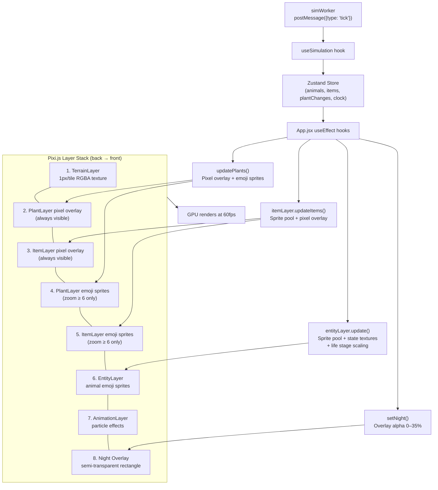

# Overview & Camera

Navigation: [Documentation Home](../README.md) > [Renderer](README.md) > [Current Document](overview.md)
Return to [Documentation Home](../README.md).

---

## GameRenderer

Coordinates all layers and handles user input. All layers live inside a single `PIXI.Container` (`worldContainer`) transformed by the camera.

```javascript
const renderer = new GameRenderer(container, onViewportChange, onTileClick);
```

### Public Methods

| Method | Description |
|--------|-------------|
| `setTerrain(terrainData, width, height)` | Initialize terrain texture, plant buffers, camera bounds |
| `updatePlants(plantChanges)` | Apply plant deltas to pixel overlay and emoji sprites |
| `setNight(isNight)` | Toggle night overlay (alpha 0 or 0.35) |
| `centerOn(tileX, tileY)` | Pan camera to center on a tile |
| `getViewportTiles()` | Current visible tile range `{x, y, w, h}` |
| `destroy()` | Cleanup Pixi app, observers, listeners |

### Input Handling

| Input | Action |
|-------|--------|
| Mouse wheel | Zoom in/out (factor 1.15× per step) |
| Click + drag | Pan the viewport (default behavior) |
| Left-click + drag in PLACE_ENTITY tool | Paint entities tile-by-tile via repeated `onTileClick(x, y)` on tile changes |
| Click (no drag) | Converts screen→tile coordinates, fires `onTileClick(x, y)` |
| `V` (Three backend) | Toggle Orbit mode |
| Left drag (Three Orbit mode) | Orbit yaw around map |
| Middle or right drag (Three Orbit mode) | Pan X/Y |
| Mouse wheel (Three Orbit mode) | Zoom in/out |

Entity brush notes:


When Three Orbit mode is enabled, screen-to-tile conversion uses the inverse camera rotation so tile painting and selection remain accurate while the map is rotated.

### Three Flora 3D

- In the Three backend, flora now uses GLB models for all plant type IDs (`1..16`) when available.
- Stage behavior: stages `1..5` use plant-specific models with stage-based scaling; stage `6` (dead) keeps stump rendering for tree types.
- Runtime fallback remains enabled: if a GLB is missing or still loading, the renderer uses the existing emoji sprite path.
- Model assets are served from `public/model-assets/nature`.

---

## Camera

Manages viewport transform: pan, zoom, and coordinate conversion.

```javascript
const camera = new Camera(worldContainer, screen, onChanged);
```

### Properties

| Property | Range | Description |
|----------|-------|-------------|
| `zoom` | 1–60 | Current scale factor |
| `worldW`, `worldH` | — | Map dimensions in tiles |

### Methods

| Method | Description |
|--------|-------------|
| `pan(dx, dy)` | Move viewport by screen pixels, clamped to bounds |
| `onWheel(event)` | Zoom around mouse position |
| `centerOn(tileX, tileY)` | Position tile at screen center |
| `screenToTile(sx, sy)` → `{x, y}` | Convert screen coordinates to world tile |
| `getViewportTiles()` → `{x, y, w, h}` | Current visible tile range |

### Coordinate System

```
World (tiles) ←→ Texture (1px = 1 tile) ←→ Screen (Pixi app)

Screen → Tile:
  tileX = (screenX - container.x) / zoom
  tileY = (screenY - container.y) / zoom
```

Animal positions are **sub-tile floats** (e.g. `5.5, 3.25`), already centered at `tile + 0.5`. Sprites are placed directly at `(animal.x, animal.y)` in world coordinates — no `+0.5` offset is needed. Plant and terrain coordinates remain integer tile indices.

---

## Data Flow



---

## Viewport Culling

- Animals are filtered to the current viewport in the worker (`getStateForViewport`) — includes both alive and recently dead animals
- Items are filtered to the current viewport in the worker
- Plant emojis are viewport-scoped in `PlantLayer.updateEmojis()`
- Item emojis are updated in `ItemLayer.updateItems()` as part of the simulation tick
- Terrain and plant/item pixel overlays cover the full map (single texture each)

---

## See Also

- [Rendering Layers](layers.md) — detailed layer implementation, sprite pooling, animations, emoji textures
- [Architecture: Tick Pipeline](../architecture.md#simulation-tick) — full data flow from worker to screen
- [Worker API: Messages](../api/messages.md) — tick message format consumed by the renderer
