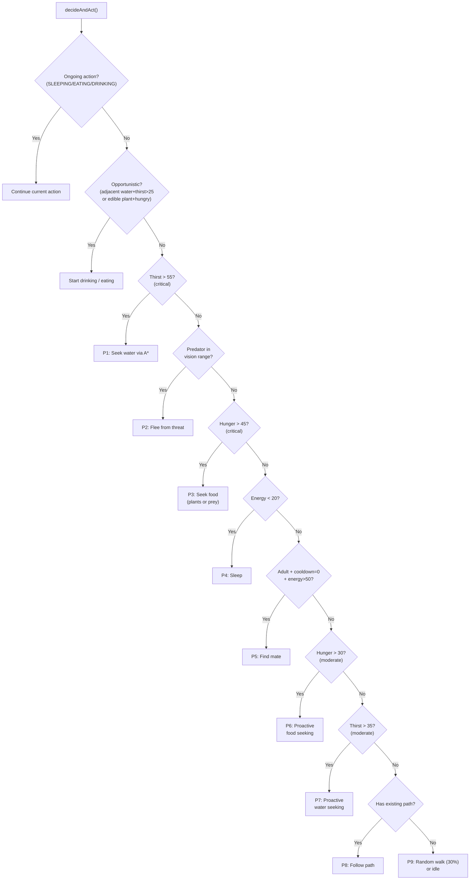

# Animal AI

Navigation: [Documentation Home](../README.md) > [Simulation](README.md) > [Current Document](ai.md)
Return to [Documentation Home](../README.md).

Each tick, every alive animal runs `decideAndAct()`, which evaluates priorities in strict order. The first matching condition wins.

See [Movement System](movement.md) for how animals travel, and [Energy & Needs](energy.md) for threshold context.

---

## Ongoing Actions

If the animal is currently `SLEEPING`, `EATING`, or `DRINKING`, the action continues until complete. These are always processed first before any new decision is made.

---

## Opportunistic Actions

Checked before the priority queue — these trigger immediately when local conditions are met.

| Condition | Action |
|-----------|--------|
| Adjacent to water AND thirst > 25 | Start drinking |
| On edible plant tile AND hunger > threshold | Start eating (threshold varies by plant stage) |

---

## Priority-Based Decisions



| Priority | Condition | Action |
|----------|-----------|--------|
| 1 | Thirst > 55 (critical) | Seek water via A* |
| 2 | Predator in vision range (herbivores/omnivores) | Flee |
| 3 | Hunger > 45 (critical) | Seek food (plants or prey) |
| 4 | Energy < 20 | Sleep |
| 5 | Adult + cooldown = 0 + energy > 50 | Find mate |
| 6 | Hunger > 30 (moderate) | Proactive food seeking |
| 7 | Thirst > 35 (moderate) | Proactive water seeking |
| 8 | Has existing path | Follow path |
| 9 | Else | Random walk (30% chance) or idle |

---

## Vision Range

Vision is computed from the species base stat and modified by config and day/night cycle:

```
vision_now = max(1, floor(vision_range × animal_global_vision_multiplier × dayNightModifier))
```

| Condition | Modifier |
|-----------|----------|
| Non-nocturnal species at night | `night_vision_reduction_factor` (default 0.65) |
| Nocturnal species during day | `nocturnal_day_vision_factor` (default 0.8) |
| Otherwise | 1.0 |

Vision is clamped to a minimum of 1 tile to prevent zero-range behavior. Thresholds driving priorities are species-configurable via `decision_thresholds` in `animalSpecies.js`.

---

## Threat Detection (Flee Behavior)

Herbivores and omnivores scan their vision range for carnivores using the spatial hash. If a threat is found:

1. Enter `FLEE` state
2. Burst-move away from the threat using `effectiveSpeed = ceil(speed / SUB_CELL_DIVISOR)` bursts
3. **Direct flee:** tries stepping 3 → 1 tiles along the escape vector
4. **Lateral fallback:** evaluates all 8 neighbors if the direct path is blocked
5. Flying species receive +1 burst

Both herbivores and omnivores flee from stronger predators.

---

## Threat Detection Cache

Scanning for threats is expensive (spatial hash query + diet validation per neighbor). To reduce cost:

- Results are cached for **4 ticks** per animal (`threatCacheTTL`)
- Cache stores: threat entity ref, distance, direction vector
- Cache is invalidated early if the animal crosses a tile boundary
- Each species has a staggered decision interval (e.g., insects decide every 2 ticks, large predators every tick)

---

## Day/Night Activity

Animals have a `nocturnal` flag in their species config. Activity penalties apply when active during the wrong period:

| Scenario | Vision Modifier | Energy Cost Modifier |
|----------|----------------|---------------------|
| Diurnal species during day | 1.0× | 1.0× |
| Diurnal species at night | 0.65× (`night_vision_reduction_factor`) | 1.3× |
| Nocturnal species at night | 1.0× | 1.0× |
| Nocturnal species during day | 0.8× (`nocturnal_day_vision_factor`) | 1.3× |

---

## See Also

- [Movement System](movement.md) — how animals travel and terrain costs
- [Energy & Needs](energy.md) — threshold values and energy costs
- [HP & Combat](combat.md) — combat mechanics and damage
- [Reproduction](reproduction.md) — mating conditions and population caps
- [Animal Species Registry](../engine/animal-species.md) — species stats and thresholds
- [Architecture: Tick Pipeline](../architecture.md#simulation-tick) — how AI fits in the tick loop
