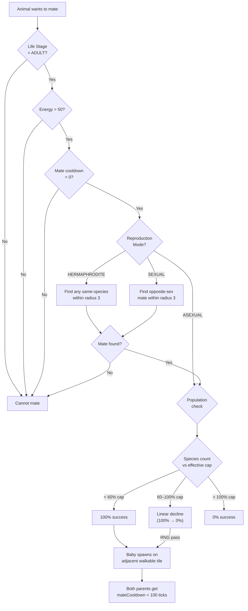

# Animal Interactions

Navigation: [Documentation Home](../README.md) > [Simulation](README.md) > [Current Document](animal-interactions.md)
Return to [Documentation Home](../README.md).

How animals lose and recover HP, attack prey, mate, and regulate population growth.

Related documentation: [Animal AI](ai.md), [Energy & Needs](energy.md), [Animal Species Registry](../engine/animal-species.md), [World & Entities](../engine/world.md).

---

## Contents

| Section | Description |
|---------|-------------|
| [HP & Combat](#hp--combat) | Health points, damage sources, recovery, death conditions, attack rules |
| [Reproduction](#reproduction) | Mating requirements, sex compatibility, offspring, population throttling |

---

## HP & Combat

### HP (Health Points) System

Every animal has an `hp` stat representing physical health. HP is the **sole survival metric** — when HP reaches 0 the animal dies.

#### Max HP by Species

| Tier | Species | Max HP |
|------|---------|--------|
| Insects | 🦟 Mosquito | 10 |
| Insects | 🐛 Caterpillar, 🦗 Cricket | 15 |
| Insects | 🪲 Beetle | 20 |
| Small | 🐦‍⬛ Crow | 30 |
| Small | 🐿️ Squirrel, 🐍 Snake | 40 |
| Mid | 🦎 Lizard, 🦅 Hawk | 45 |
| Mid | 🐰 Rabbit, 🦝 Raccoon | 50 |
| Mid | 🦊 Fox | 60 |
| Large | 🦌 Deer | 70 |
| Large | 🐐 Goat | 80 |
| Large | 🐗 Boar | 100 |
| Apex | 🐺 Wolf | 120 |
| Apex | 🐊 Crocodile | 180 |
| Apex | 🐻 Bear | 200 |

#### HP Damage Sources

| Source | Damage | Notes |
|--------|--------|-------|
| Combat (attacked) | `attackPower − defense × defense_factor` (min `min_damage`) | Per attack hit |
| High hunger (> 80% of max) | 0–0.5 per tick (scales linearly) | Stacks with thirst penalty |
| High thirst (> 80% of max) | 0–0.5 per tick (scales linearly) | Stacks with hunger penalty |

HP penalty formula:

```
penalty = max_penalty × (stat - threshold) / (max_stat - threshold)
```

Defaults: `threshold_fraction = 0.8`, `max_penalty = 0.5`.

#### HP Recovery Sources

| Source | Recovery | Notes |
|--------|----------|-------|
| Sleeping | +0.8 per tick | Most reliable recovery method |
| Idle | +0.01 per tick | Slow passive regen |
| Eating plant (Fruit stage) | +10 | Best plant nutrition |
| Eating plant (Adult stage) | +5 | Moderate |
| Eating plant (Seed stage) | +3 | Minimal |
| Ongoing eating state | +2 per tick | While in EATING state |
| Scavenging corpse | +8 | Corpse consumption |
| Killing prey | +15 | Attacker bonus on kill |

#### Death Conditions

- HP reaches 0 → death
- Age exceeds `max_age` → death

Hunger, thirst, and energy **do not kill directly**. High hunger/thirst drain HP over time, and zero energy forces sleep.

### Combat

Triggered when a carnivore reaches an adjacent prey tile.

```
damage = attacker.attackPower − (defender.defense × defense_factor)
minimum damage = min_damage
```

- Defender's `hp` is reduced by `damage`
- If defender HP ≤ 0 → defender dies
- On kill: attacker recovers hunger (−80), energy (+25), and HP (+15)
- Cooldown and damage coefficients are species-configurable via `combat` in `animalSpecies.js`

**Defaults:** `cooldown = 3`, `defense_factor = 0.5`, `min_damage = 1`

---

## Reproduction



### Requirements

| Condition | Value |
|-----------|-------|
| Life Stage | `ADULT` (LifeStage 3) |
| Energy | > 50 |
| Mate cooldown | = 0 |
| Nearby mate | Within radius 3 |

### Sex Compatibility

| Mode | Rule |
|------|------|
| `SEXUAL` | Requires opposite sex (male + female) |
| `HERMAPHRODITE` | Any two of same species |
| `ASEXUAL` | Reproduces alone |

### Offspring

- Baby spawns on an adjacent walkable tile at tile center (`tileX + 0.5, tileY + 0.5`)
- Initial energy: 40% of species max
- Age: 0 (Life Stage: BABY)
- Both parents enter `MATING` state and receive `mateCooldown = 100` ticks

### Population Cap

Reproduction is throttled by species population:

- Each species has a `max_population` base cap (varies by tier: 80–800)
- When the global budget `max_animal_population` is set (> 0), effective caps are scaled proportionally:

  ```
  effectiveCap = baseCap × globalBudget / BASE_POP_TOTAL
  ```

- At 60% of effective cap: 100% mating success
- At 100% of effective cap: 0% mating success
- Linear decline between 60–100% capacity

The same effective cap calculation is also applied before the initial spawn pass, so the world never starts above the configured global budget or a species-specific effective cap.

Population count uses `world.getAliveSpeciesCount(species)`, which is lazily cached once per tick to avoid O(N) linear scans.

---

## See Also

- [Animal AI](ai.md) — threat detection, attack priority, and mating priority
- [Energy & Needs](energy.md) — attack costs, kill rewards, and mating energy thresholds
- [Animal Species Registry](../engine/animal-species.md) — per-species HP, attack, defense, and reproduction settings
- [World & Entities](../engine/world.md) — sex assignment, life stages, and animal state machine
