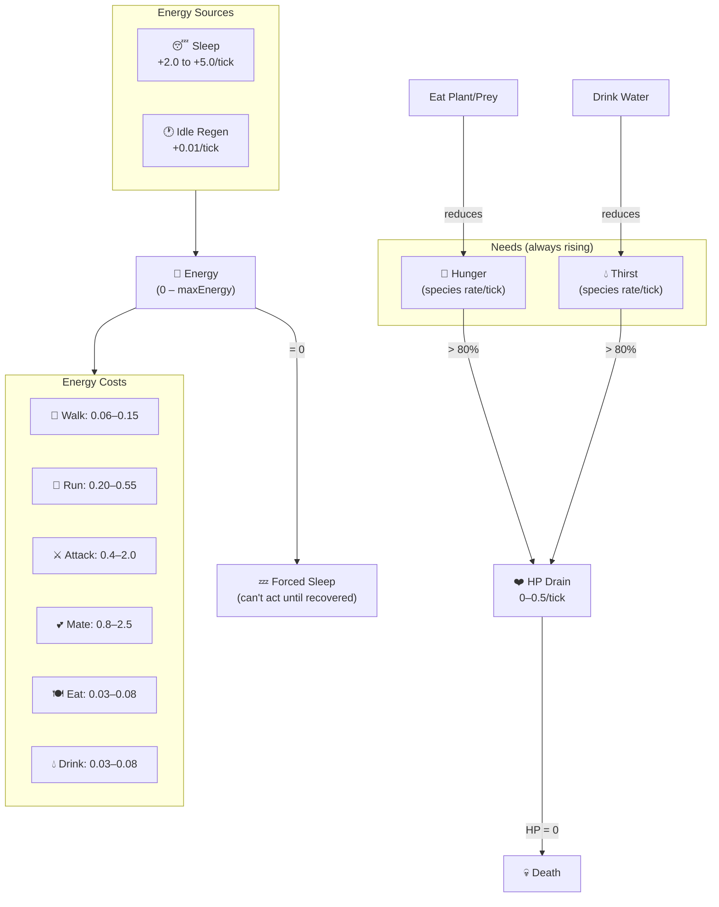

# Energy & Needs

Navigation: [Documentation Home](../README.md) > [Simulation](README.md) > [Current Document](energy.md)
Return to [Documentation Home](../README.md).

---

## Energy System

Every action costs energy. Energy is clamped between 0 and `maxEnergy` (species-specific).

| Action | Typical Cost Range | Notes |
|--------|--------------------|-------|
| IDLE | 0.01–0.04 | Minimal drain |
| WALK | 0.06–0.15 | Standard movement |
| RUN | 0.20–0.55 | Fast movement (fleeing, chasing) |
| EAT | 0.03–0.08 | Consuming food |
| DRINK | 0.03–0.08 | Consuming water |
| SLEEP | −2.0 to −3.5 | **Recovers** energy (negative cost) |
| ATTACK | 0.4–2.0 | Combat |
| MATE | 0.8–2.5 | Reproduction |
| FLEE | 0.2–0.6 | Escape predators |

### Passive Regeneration

Animals slowly recover energy and HP during light activities:

| State | Energy Regen/tick | HP Regen/tick |
|-------|-------------------|---------------|
| Idle | +0.01 | +0.01 |
| Sleeping | via SLEEP cost (e.g. +2.0 to +5.0) | +0.8 |

These recovery values are configurable per species via `recovery` in the derived animal config.

### Energy Depletion

When energy reaches 0 the animal is **forced to sleep** and cannot perform any other action. While sleeping, hunger and thirst continue to rise (via `tickNeeds`), which may cause HP damage. The animal must recover energy before it can eat or drink.

---

## Needs System

Animals have two constantly increasing needs:

| Need | Rate | Consequences |
|------|------|-------------|
| **Hunger** | species-specific | High hunger (> 80%) drains HP over time |
| **Thirst** | species-specific | High thirst (> 80%) drains HP over time |

Both needs are species-configurable via `decision_thresholds` in `animalSpecies.js`.

---

## Feeding

### Herbivores

Herbivores seek plants:

- Plants have **edible stages** defined per species (see [Plant Lifecycle](plants.md))
- Fruit-producing plants: edible at Seed (stage 1) and Fruit (stage 5)
- Non-fruit plants: edible at Seed (stage 1) and Adult (stage 4)
- Oak Tree and Cactus: only edible at Seed (stage 1)
- Eating **removes the plant entirely** (tile cleared)
- Stage-based nutrition: Seed = 15 hunger, Adult = 35, Fruit = 55
- Vision-range search can expand when hunger is high (species-configurable desperation thresholds)

### Carnivores

Carnivores seek prey:

- Use spatial hash for radius query within vision range
- Chase and attack nearest prey
- Multi-step RUN pursuit if adjacent
- Fallback: eat fruit if available

---

## Scavenging

Some species can eat decomposing bodies (dead animals still on the map).

| Can Scavenge | Cannot Scavenge |
|--------------|----------------|
| Beetle, Fox, Wolf, Boar, Bear, Raccoon, Crow, Crocodile | Rabbit, Squirrel, Goat, Deer, Mosquito, Caterpillar, Snake, Hawk |

Only species with `can_scavenge: true` in the species registry can scavenge. The `scavenge_decay_ticks` config parameter (default 100) defines the fresh-corpse window.

---

## See Also

- [Animal AI](ai.md) — how energy thresholds drive AI decisions
- [Movement System](movement.md) — terrain energy multipliers
- [HP & Combat](combat.md) — combat energy costs and kill rewards
- [Animal Species Registry](../engine/animal-species.md) — per-species energy values and recovery rates
- [Plant Lifecycle](plants.md) — stage-based plant nutrition values
