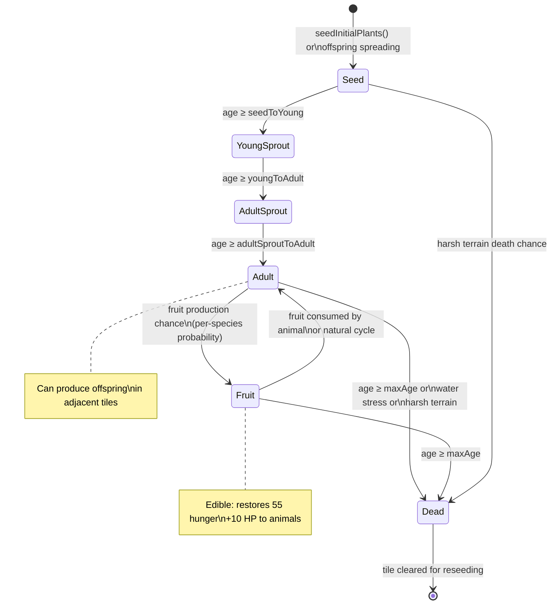

# Plant Lifecycle

Navigation: [Documentation Home](../README.md) > [Simulation](README.md) > [Current Document](plants.md)
Return to [Documentation Home](../README.md).

---

## Plant Types

| Emoji | Type | Constant | Reproduction | Notes |
|-------|------|----------|-------------|-------|
| 🌱 | Grass | `P_GRASS = 1` | Seed | Most common, fast growth |
| 🍓 | Strawberry | `P_STRAWBERRY = 2` | Fruit | Medium water affinity |
| 🫐 | Blueberry | `P_BLUEBERRY = 3` | Fruit | Medium water affinity |
| 🍎 | Apple Tree | `P_APPLE_TREE = 4` | Fruit | Slow growth, long-lived |
| 🥭 | Mango Tree | `P_MANGO_TREE = 5` | Fruit | Slow growth, long-lived |
| 🥕 | Carrot | `P_CARROT = 6` | Seed | Inland |
| 🌻 | Sunflower | `P_SUNFLOWER = 7` | Seed | Fast growth |
| 🍅 | Tomato | `P_TOMATO = 8` | Fruit | Medium water affinity |
| 🍄 | Mushroom | `P_MUSHROOM = 9` | Seed | Fastest lifecycle |
| 🌳 | Oak Tree | `P_OAK_TREE = 10` | Seed | Longest-lived, slow growth |
| 🌵 | Cactus | `P_CACTUS = 11` | Seed | Desert plant, thrives on sand/rock |
| 🌴 | Coconut Palm | `P_COCONUT_PALM = 12` | Fruit | Coastal tree, grows on sand |
| 🥔 | Potato | `P_POTATO = 13` | Seed | Root crop, resilient inland |
| 🌶️ | Chili Pepper | `P_CHILI_PEPPER = 14` | Fruit | Medium water affinity |
| 🫒 | Olive Tree | `P_OLIVE_TREE = 15` | Fruit | Drought-tolerant tree || 🌼 Edelweiss | `P_EDELWEISS = 16` | Seed | Mountain plant; thrives on ROCK and MOUNTAIN terrain |
---

## Growth Stages



### Growth Age Calculation

Effective age is a compound of multiple multipliers:

```
effectiveAge = baseAge × waterMult × terrainMult × combinedGrowth × crowdingMult
```

where `combinedGrowth = seasonGrowth × tempGrowth`.

| Factor | Source | Effect |
|--------|--------|--------|
| `waterMult` | Distance to nearest water tile + species water affinity | Closer to water = faster growth |
| `terrainMult` | Per-species `terrainGrowth` map | Soil type suitability |
| `seasonGrowth` | Seasonal cycle (4 seasons) | Spring boost, winter slowdown |
| `tempGrowth` | Current temperature vs. optimal range | Extreme cold/heat reduces growth |
| `crowdingMult` | Neighbor plant density | Dense areas slow growth |

Each stage transition is governed by age thresholds in ticks, defined in `plantSpecies.js`. Thresholds below are at the default `ticks_per_day = 500`:

| Plant | Seed→Young | Young→Adult Sprout | Adult Sprout→Adult | Max Age |
|-------|------------|-------------------|-------------------|---------|
| Grass | 8 | 29 | 56 | 365 |
| Strawberry | 19 | 77 | 192 | 769 |
| Blueberry | 29 | 106 | 269 | 1058 |
| Apple Tree | 67 | 269 | 673 | 3077 |
| Mango Tree | 77 | 346 | 808 | 3461 |
| Carrot | 15 | 67 | 154 | 673 |
| Sunflower | 15 | 73 | 192 | 961 |
| Tomato | 19 | 86 | 231 | 865 |
| Mushroom | 11 | 42 | 96 | 423 |
| Oak Tree | 96 | 423 | 961 | 4808 |
| Cactus | 58 | 231 | 577 | 3077 |
| Coconut Palm | 115 | 500 | 1115 | 4615 |
| Potato | 23 | 81 | 183 | 808 |
| Chili Pepper | 21 | 89 | 240 | 961 |
| Olive Tree | 106 | 461 | 1077 | 5000 |
| Edelweiss | 19 | 77 | 173 | 769 |

---

## Water Proximity Bonus

Plants within `water_proximity_threshold` (default 10) tiles of water receive a growth bonus. Water growth multipliers are configurable via `plant_water_growth_modifiers` in `config.js`.

---

## Seed Germination via Ground Items

Fruit-producing plants drop **fruit items** on adjacent tiles when their flora seeding system runs. These items follow a two-step decay:

```
FRUIT item  →  (after item_fruit_to_seed_ticks = 200 ticks)
SEED item   →  (after germinationTicks, rolls 20% chance)
New plant at S_SEED stage   OR   item removed (80%)
```

The `germinationTicks` value is taken from the plant species' `seedGerminationTicks` field in `plantSpecies.js`. If the field is absent, the engine falls back to `config.item_seed_germination_ticks` (default 400 ticks). The germination chance is controlled by `config.item_seed_germination_chance` (default 0.20).

Germination succeeds only if the target tile currently has no plant (`plantType = P_NONE`). A successful germination writes the new plant at stage `S_SEED` (stage 1) with age 0, from which it advances through the normal flora lifecycle.

This mechanism supplements the existing in-engine plant reproduction (which spreads seeds to adjacent tiles) and creates a distinct pathway for new plants to appear at locations where animals have carried or dropped fruit.

---

## Terrain Growth Modifiers

Each plant species defines a per-terrain growth multiplier in `terrainGrowth`. Growth rate is multiplied by the terrain factor each tick. A value of `0.0` means the plant cannot grow on that terrain at all.

| Terrain | Typical Range | Notes |
|---------|--------------|-------|
| SOIL | 0.4–1.2× | Default growing terrain for most plants |
| FERTILE_SOIL | 0.3–1.3× | Best for most non-desert plants |
| DIRT | 0.3–0.8× | Generally slower growth |
| SAND | 0.0–1.5× | Only desert plants (Cactus, Coconut Palm) thrive here |
| ROCK | 0.0–1.2× | Most plants cannot grow; Cactus tolerates it |
| MOUNTAIN | 0.0–0.8× | Very few plants survive |
| MUD | 0.0–0.8× | Swampy terrain, variable growth |

Full per-species terrain multipliers are defined in `plantSpecies.js`. Notably, Edelweiss is the only plant that strongly prefers ROCK (`1.2×`) and MOUNTAIN (`1.5×`) terrain, and cannot grow on MUD.

---

## Temperature Model

Each tick, `computeTemperature(world)` derives the current ambient temperature in °C from a deterministic seasonal base plus a sinusoidal daily cycle:

```
T = temperature_base[season] + temperature_amplitude[season] × thermCurve
```

- **Daytime** (`dayPos < dayFraction`): `thermCurve = sin(π × dayPos / dayFraction)` — peaks at solar noon.
- **Night** (`dayPos ≥ dayFraction`): `thermCurve = −0.15 × sin(π × nightPos)` — slight dip below the base.

The computed temperature is stored as `world.temperature` for worker/UI access.

### Growth Rate Multiplier (`tempGrowth`)

| Range | Multiplier |
|-------|-----------|
| `temperature_optimal_min` to `temperature_optimal_max` (10–30 °C) | 1.0 |
| `temperature_growth_min` to `temperature_optimal_min` (2–10 °C) | Linear ramp 0.5 → 1.0 |
| Below `temperature_growth_min` (< 2 °C) | `max(0.1, ...)` — near zero |
| `temperature_optimal_max` to `temperature_growth_max` (30–40 °C) | Linear ramp 1.0 → 0.6 |
| Above `temperature_growth_max` (> 40 °C) | 0.6 (floor) |

### Death Rate Multiplier (`tempDeath`)

| Condition | Multiplier |
|-----------|-----------|
| Below `temperature_death_cold_threshold` (< 4 °C) | Rises up to 1.8× at extreme cold |
| Above `temperature_death_heat_threshold` (> 35 °C) | Rises up to 1.5× at extreme heat |
| Otherwise | 1.0 |

Both multipliers combine with the existing seasonal multipliers so plants near the edges of their thermal tolerance experience compounded stress during harsh seasons.

---

## See Also

- [Plant Species Registry](../engine/plant-species.md) — canonical species data and stage ages
- [Energy & Needs: Feeding](energy.md#feeding) — how animals consume plants
- [Algorithms: Terrain Generation](../engine/algorithms.md#terrain-generation-mapgeneratorjs) — water proximity BFS
- [Architecture: Tick Pipeline](../architecture.md#simulation-tick) — where flora processing fits in the tick
