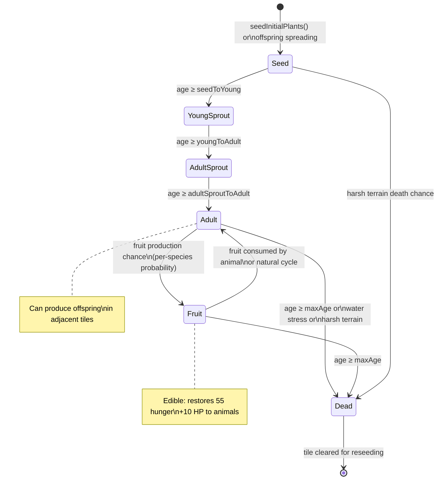

# Plant Lifecycle

Navigation: [Documentation Home](../README.md) > [Simulation](README.md) > [Current Document](plants.md)
Return to [Documentation Home](../README.md).

---

## Plant Types

| Emoji | Type | Constant | Reproduction | Notes |
|-------|------|----------|-------------|-------|
| 🌱 | Grass | `P_GRASS = 1` | Seed | Most common, fast growth |
| 🍓 | Strawberry | `P_STRAWBERRY = 2` | Fruit | Medium water affinity |
| 🫐 | Blueberry | `P_BLUEBERRY = 3` | Fruit | Medium water affinity |
| 🍎 | Apple Tree | `P_APPLE_TREE = 4` | Fruit | Slow growth, long-lived |
| 🥭 | Mango Tree | `P_MANGO_TREE = 5` | Fruit | Slow growth, long-lived |
| 🥕 | Carrot | `P_CARROT = 6` | Seed | Inland |
| 🌻 | Sunflower | `P_SUNFLOWER = 7` | Seed | Fast growth |
| 🍅 | Tomato | `P_TOMATO = 8` | Fruit | Medium water affinity |
| 🍄 | Mushroom | `P_MUSHROOM = 9` | Seed | Fastest lifecycle |
| 🌳 | Oak Tree | `P_OAK_TREE = 10` | Seed | Longest-lived, slow growth |
| 🌵 | Cactus | `P_CACTUS = 11` | Seed | Desert plant, thrives on sand/rock |
| 🌴 | Coconut Palm | `P_COCONUT_PALM = 12` | Fruit | Coastal tree, grows on sand |
| 🥔 | Potato | `P_POTATO = 13` | Seed | Root crop, resilient inland |
| 🌶️ | Chili Pepper | `P_CHILI_PEPPER = 14` | Fruit | Medium water affinity |
| 🫒 | Olive Tree | `P_OLIVE_TREE = 15` | Fruit | Drought-tolerant tree |

---

## Growth Stages



### Growth Age Calculation

Effective age is a compound of multiple multipliers:

```
effectiveAge = baseAge × waterMult × terrainMult × seasonGrowth × crowdingMult
```

| Factor | Source | Effect |
|--------|--------|--------|
| `waterMult` | Distance to nearest water tile + species water affinity | Closer to water = faster growth |
| `terrainMult` | Per-species `terrainGrowth` map | Soil type suitability |
| `seasonGrowth` | Seasonal cycle (4 seasons) | Spring boost, winter slowdown |
| `crowdingMult` | Neighbor plant density | Dense areas slow growth |

Each stage transition is governed by age thresholds in ticks, defined in `plantSpecies.js`:

| Plant | Seed→Young | Young→Adult Sprout | Adult Sprout→Adult | Max Age |
|-------|------------|-------------------|-------------------|---------|
| Grass | 5 | 18 | 35 | 180 |
| Strawberry | 10 | 40 | 100 | 400 |
| Blueberry | 15 | 55 | 140 | 550 |
| Apple Tree | 35 | 140 | 350 | 1600 |
| Mango Tree | 40 | 180 | 420 | 1800 |
| Carrot | 8 | 35 | 80 | 350 |
| Sunflower | 8 | 38 | 100 | 500 |
| Tomato | 10 | 45 | 120 | 450 |
| Mushroom | 6 | 22 | 50 | 220 |
| Oak Tree | 50 | 220 | 500 | 2500 |
| Cactus | 30 | 120 | 300 | 1600 |
| Coconut Palm | 60 | 260 | 580 | 2400 |
| Potato | 12 | 42 | 95 | 420 |
| Chili Pepper | 11 | 46 | 125 | 500 |
| Olive Tree | 55 | 240 | 560 | 2600 |

---

## Water Proximity Bonus

Plants within `water_proximity_threshold` (default 10) tiles of water receive a growth bonus. Water growth multipliers are configurable via `plant_water_growth_modifiers` in `config.js`.

---

## Terrain Growth Modifiers

Each plant species defines a per-terrain growth multiplier in `terrainGrowth`. Growth rate is multiplied by the terrain factor each tick. A value of `0.0` means the plant cannot grow on that terrain at all.

| Terrain | Typical Range | Notes |
|---------|--------------|-------|
| SOIL | 0.4–1.2× | Default growing terrain for most plants |
| FERTILE_SOIL | 0.3–1.3× | Best for most non-desert plants |
| DIRT | 0.3–0.8× | Generally slower growth |
| SAND | 0.0–1.5× | Only desert plants (Cactus, Coconut Palm) thrive here |
| ROCK | 0.0–1.2× | Most plants cannot grow; Cactus tolerates it |
| MOUNTAIN | 0.0–0.8× | Very few plants survive |
| MUD | 0.0–0.8× | Swampy terrain, variable growth |

Full per-species terrain multipliers are defined in `plantSpecies.js`.

---

## See Also

- [Plant Species Registry](../engine/plant-species.md) — canonical species data and stage ages
- [Energy & Needs: Feeding](energy.md#feeding) — how animals consume plants
- [Algorithms: Terrain Generation](../engine/algorithms.md#terrain-generation-mapgeneratorjs) — water proximity BFS
- [Architecture: Tick Pipeline](../architecture.md#simulation-tick) — where flora processing fits in the tick
