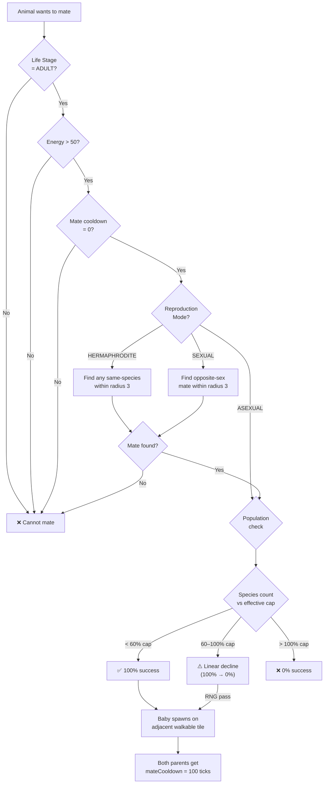

# Reproduction

Navigation: [Documentation Home](../README.md) > [Simulation](README.md) > [Current Document](reproduction.md)
Return to [Documentation Home](../README.md).



---

## Requirements

| Condition | Value |
|-----------|-------|
| Life Stage | `ADULT` (LifeStage 3) |
| Energy | > 50 |
| Mate cooldown | = 0 |
| Nearby mate | Within radius 3 |

---

## Sex Compatibility

| Mode | Rule |
|------|------|
| `SEXUAL` | Requires opposite sex (male + female) |
| `HERMAPHRODITE` | Any two of same species |
| `ASEXUAL` | Reproduces alone |

---

## Offspring

- Baby spawns on an adjacent walkable tile at tile center (`tileX + 0.5, tileY + 0.5`)
- Initial energy: 40% of species max
- Age: 0 (Life Stage: BABY)
- Both parents enter `MATING` state and receive `mateCooldown = 100` ticks

---

## Population Cap

Reproduction is throttled by species population:

- Each species has a `max_population` base cap (varies by tier: 80–800)
- When the global budget `max_animal_population` is set (> 0), effective caps are scaled proportionally:

  ```
  effectiveCap = baseCap × globalBudget / BASE_POP_TOTAL
  ```

- At 60% of effective cap: 100% mating success
- At 100% of effective cap: 0% mating success
- Linear decline between 60–100% capacity

Population count uses `world.getAliveSpeciesCount(species)`, which is lazily cached once per tick to avoid O(N) linear scans.

---

## See Also

- [Animal AI](ai.md) — mating priority in the decision tree (P5)
- [Energy & Needs](energy.md) — energy costs of mating
- [Animal Species Registry](../engine/animal-species.md) — per-species max_population and reproduction mode
- [World & Entities](../engine/world.md) — sex assignment and life stages
